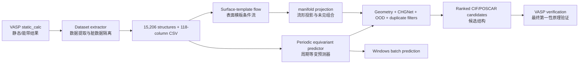

# NFE MXene Studio

> Source update (2026-09-18): current code and project records are synchronized here. Published binary/model assets remain at version 1.0; see [download status](docs/DOWNLOADS.md).


> 面向近自由电子态（Nearly Free Electron, NFE）MXene 的数据构建、性质预测、条件晶体生成、物理筛选与 Windows 可视化工具链。  
> An end-to-end toolkit for NFE-aware MXene dataset construction, property prediction,
> conditional crystal generation, physics screening, and Windows visualization.

作者 / Author: **Ruck**  
开源整理时间 / Open-source release: **2026-07-30**

## 学术摘要 / Academic abstract

MXene 近自由电子态（nearly free electron, NFE）是空间分布在二维材料表面外侧、沿
面内方向离域，并可能位于费米能级附近的一类特殊电子态。其形成与核心元素、过渡金属
层、表面端基、表面偶极、功函数及弛豫后几何结构强耦合。传统研究通常依赖逐个结构执行
DFT 能带、投影轨道、有效质量、ELF/电荷密度和真空势分析；当金属组合、层数、堆垛和
端基共同形成组合空间时，候选枚举与验证成本迅速增长。

本项目将该问题表述为一个带物理证据链的材料信息学闭环：

1. 从已弛豫并完成静态/能带计算的 VASP 结果构建可追溯 NFE 数据集；
2. 用周期旋转等变图神经网络完成结构到 NFE 档位、连续分数及辅助电子性质的正向预测；
3. 用表面模板条件流匹配模型求解“给定目标 NFE 档位和 MXene 骨架”的逆向结构生成；
4. 用 MXene 表面拓扑、训练流形投影、CHGNet 预弛豫、重复检测、OOD 与独立预测器复评
   构成生成后的物理门控；
5. 将通过门控的 CIF/POSCAR 作为高优先级计算假设，再交由统一参数的 VASP 验证。

因此，本项目的目标不是以机器学习替代第一性原理计算，而是把昂贵的无差别枚举转化为
“快速预筛选—受约束假设生成—少量高价值 DFT 验证”。

**English.** This project formulates NFE-aware MXene discovery as an auditable
forward–inverse materials-learning loop. A periodic equivariant predictor maps
relaxed structures to calibrated NFE classes, a continuous pseudo-score, auxiliary
electronic observables, uncertainty, and OOD risk. A surface-aware conditional
flow model proposes structures for a requested NFE regime, while topology rules,
manifold projection, CHGNet relaxation, duplicate rejection, and independent
rescoring prevent raw neural outputs from being treated as physical discoveries.

## 研究背景与领域空白 / Research gap

经典 MXene NFE 研究已经说明：NFE 态可位于表面外侧并沿表面延展，OH 等端基能够显著
改变其相对费米能级的位置。然而，从“证明若干材料存在 NFE”走向“在大规模、复杂端基
和多金属组合空间中按目标强度设计 NFE MXene”，仍存在以下方法学缺口。

| 领域现状 | 尚未充分解决的问题 | 本项目的响应 |
|---|---|---|
| 代表性结构的逐例 DFT 研究 | 计算证据分散，难以形成可复用的机器学习标签与统一质量门 | 118 字段数据模式、72 条脏数据隔离、逐样本审计与来源追踪 |
| MXene 机器学习多聚焦稳定性、力学、催化或通用电子性质 | 缺少面向 NFE 机理分量的专用结构预测、校准和 OOD 体系 | 三分类 + 连续 NFE 分数 + 电子性质多任务 + 温度校准 + MC/OOD |
| 正向筛选回答“给定结构像不像 NFE” | 难以回答“给定 low/medium/high，应该计算什么结构” | 目标 NFE 档位、C/N 核心和内层金属条件下的结构逆向生成 |
| 通用晶体生成器主要处理三维体相几何 | 对带真空层、上下表面、端基、OH 和 hollow 位点的二维 MXene 容易层塌缩或基团破坏 | 2D 周期图、角色掩码、端基锚点、层序/OH/配对损失与流形投影 |
| 生成模型常以几何可解析或模型分数作为成功标准 | 可解析 CIF 不等于弛豫稳定、目标匹配或非重复 | CHGNet 固定晶胞预弛豫 + 严格拓扑 + 训练集去重 + 独立 NFE 复评 |
| 高概率输出容易被误解为材料发现 | 缺少证据层级和计算闭环 | 明确区分伪标签、模型预测、ML 势预筛选与最终 DFT 结论 |


## 核心科学问题 / Scientific questions

- **Q1：如何把 NFE 从模糊的能带观察转化为可学习、可审计的目标？**  
  将低原子轨道投影、Γ 附近抛物线拟合、相对费米能、有效质量与面内各向同性拆分为
  独立分量，形成连续伪分数和 low/medium/high 档位，并保留原始证据字段。

- **Q2：只给 CIF/POSCAR，能否快速筛选 NFE 候选？**  
  周期等变图网络从元素、局部环境、晶格与表面几何中同时学习分类和电子性质回归，
  并报告校准概率、不确定性和训练分布外风险。

- **Q3：能否从目标 NFE 档位反推出值得计算的 MXene 结构？**  
  条件流模型在已弛豫 MXene 的表面模板流形附近生成结构，用户指定核心与内层金属，
  端基则由训练分布和目标条件共同决定。

- **Q4：如何在 VASP 之前降低无效生成结构比例？**  
  将二维表面拓扑硬约束、键长分位、CHGNet 力阈值、重复检测、OOD 和 NFE 独立复评
  串联为接受集合，而不是直接输出神经网络的原始坐标。

## 创新点与贡献边界 / Contributions and novelty

本项目使用 PaiNN 风格等变消息传递、Flow Matching、classifier-free guidance、
CHGNet、pymatgen 等已有方法。创新主要位于 **NFE 专属任务定义、MXene 表面建模和
跨模型闭环集成**，并不声称发明这些基础算法。

1. **NFE 物理证据因子化的数据体系。**  
   将能带曲率、原子投影、有效质量、各向同性、费米能位置、功函数、ELF 与表面电荷
   纳入同一可审计表，而不是只保留单一 Label。

2. **正向预测与逆向设计统一。**  
   同一数据语义同时服务于“结构 → NFE”预测和“目标 NFE → 结构”生成，使模型可用于
   候选排序，也可用于提出新的计算假设。

3. **面向二维终止表面的条件生成表示。**  
   显式区分 core、surface termination、OH oxygen/hydrogen、上下表面与层位置，并把
   hollow 配位、OH 键、金属–端基距离和层序写入损失与验证逻辑。

4. **学习流形与物理门控的混合生成。**  
   连续流负责多样性，模板流形投影控制局部合理性，CHGNet 和确定性规则负责 VASP 前
   预筛选；这一设计针对“小数据科学生成中自由度与物理有效性之间的冲突”。

5. **面向可信使用的多层不确定性。**  
   同时报告三档完整概率、温度校准、MC dropout、embedding OOD、conformal radius、
   CHGNet 力和训练集重复信息，避免把单个 softmax 最大值当作可靠性。

6. **从 HPC 到桌面端的可复现交付。**  
   四卡 DDP/AMP 训练、固定 group-aware split、数据/模型/环境归档、SHA256、Windows
   批量预测与 3D 预览共同构成可复查研究软件，而不仅是一段训练脚本。

## 科学意义与可解决问题 / Significance and solvable problems

| 使用场景 | 可提供的答案 | 节省的工作 | 仍需后续验证 |
|---|---|---|---|
| 已有 MXene 结构筛选 | low/medium/high 概率、连续分数、辅助性质、OOD | 在大批 CIF/POSCAR 中优先选择值得做电子结构分析的结构 | 收敛 DFT 能带与分波电荷密度 |
| NFE 结构–性质规律研究 | 金属、核心、端基、功函数、有效质量等共同关联 | 将分散 VASP 输出整理为可统计、可建模证据 | 因果解释与更高精度泛函检验 |
| 指定 NFE 档位的逆向设计 | 与目标 low/medium/high 匹配的候选 CIF/POSCAR | 减少人工枚举和明显不合理结构的 VASP 队列 | 全弛豫、静态、声子/热力学稳定性 |
| 新金属组合探索 | 训练集中未见组合但局部环境接近已知流形的假设 | 在可控 OOD 范围内扩展组合空间 | 对外推误差进行专门基准 |
| 计算数据治理 | clean/dirty/audit/split/字段字典 | 避免未收敛、缺文件或家族泄漏污染训练 | 原始计算参数一致性仍需人工审计 |
| 教学与复现 | 数据—预测—生成—物理筛选—GUI 全链路 | 降低材料生成模型的学习与部署门槛 | 不应把教学冒烟测试视作科学验证 |

## 1.0 设计空间的主线：穷举 + 预测器排序 / Enumeration first

当前数据只覆盖单层 M₂XT₂ 型 MXene：11 种金属、C/N、7 种端基、4 种堆垛，有序配置一共
47,432 个，已计算 15,278 个。这个空间可以穷举，不需要生成模型：

```bash
python training/entrypoints/enumerate_candidates.py \
  --predictor-checkpoint models/server_v1_1/nfe_predictor_v1_1/best.pt \
  --table data/full_v1_1/nfe_dataset.csv --dirty-table data/full_v1_1/dirty_manifest.csv \
  --root data/full_v1_1 --summary models/metadata/enumeration_summary_v1_1.json
```

脚本把 32,154 个尚未计算的配置用最近的已弛豫模板替换物种后交给预测器排序
（1.1.0 检查点：预测 high 且 OOD 低的 6,168 个，全部含 OH 端基，按端基对 Cl|OH 1,014、
F|OH 972、OH|Se 971、OH|S 896、Br|OH 895、I|OH 832、OH|OH 588；1.0 检查点为 5,333 个。
汇总见 [`models/metadata/enumeration_summary_v1_1.json`](models/metadata/enumeration_summary_v1_1.json)
与 [`enumeration_summary.json`](models/metadata/enumeration_summary.json)）。
这份表是 DFT 优先队列，不是材料结论。条件生成器保留给多层、混合端基、缺陷等无法穷举的
空间。它在 1.0 流水线中的实际自由度被流形投影限制在 0.18 Å 以内。回测
（`training/audits/backtest_generator.py`）从 test 抽样 200 个组成，其中 149 个有同堆垛训练模板，
每个用 3 个模板，无 CHGNet；目标档位取自 v1.1 表，档位由 1.1.0 预测器判定。结果表明它是同拓扑
模板的**精修器**而不是拓扑生成器：流 + 投影相对 DFT 几何的 RMSD 中位数 0.14 Å，模板 + 投影
0.25 Å，晶格误差 1.1% 对 2.7%，档位一致率 0.88 对 0.85；若模板堆垛与目标不同，三种模式都约
1.1 Å，因为投影不允许端基换 hollow 位点。1.3.0 起生成器也在 v1.1 标签上重训，同一回测的 RMSD 中位数为
0.140 Å、档位一致率 0.886，与旧生成器一致。数值见
[`models/metadata/generator_backtest_v1_1.json`](models/metadata/generator_backtest_v1_1.json) 与
[`generator_backtest_v1_1_any_stacking.json`](models/metadata/generator_backtest_v1_1_any_stacking.json)，重训生成器见
[`generator_backtest_gen_v1_1.json`](models/metadata/generator_backtest_gen_v1_1.json)；
1.0 预测器与 v1.0 表下的同一回测见 [`generator_backtest.json`](models/metadata/generator_backtest.json)。

## 本项目不能解决什么 / Out of scope

- 不能仅凭模型概率证明 NFE 态真实存在；
- 不能给出实验合成成功率、形成能凸包、动力学稳定性或有限温度寿命；
- 不能保证 CHGNet 对所有 MXene、重元素、磁态和非常规端基达到目标 DFT 精度；
- 不能把训练集中未出现的化学组合等同于完全自由、无偏的材料发现；
- 不能消除伪标签规则、类别不平衡和上游 VASP 设置带来的系统误差。

## 项目能做什么 / What this project does

| 模块 / Module | 中文说明 | English |
|---|---|---|
| 数据构建 | 从 15206个 VASP 静态与能带结果抽取 118 个字段，复制清洗结构并隔离脏数据 | Extract 118 fields from VASP static/band calculations, copy clean structures, and quarantine dirty records |
| NFE 预测 | 输入 CIF/POSCAR，输出 low/medium/high、连续 NFE 分数、置信度、OOD 与辅助物性 | Predict low/medium/high, continuous NFE score, confidence, OOD, and auxiliary properties from CIF/POSCAR |
| 条件生成 | 指定 low/medium/high、核心元素和内层金属，生成 MXene CIF/POSCAR | Generate MXene CIF/POSCAR conditioned on NFE class, core element, and inner metals |
| 物理筛选 | 居中、层序、端基、三配位 hollow、键长、CHGNet、重复与 OOD 检查 | Check centering, layers, terminations, threefold hollow sites, bonds, CHGNet, duplicates, and OOD |
| Windows App | 拖放、批量选择、批量预测、分阶段生成进度与可测量、可导出图片的交互式三维预览 | Drag/drop, batch prediction, staged generation progress, and VESTA-like interactive 3D preview |

本项目同时保留三种层次：

1. `release_assets/server/`：服务器归档的索引、manifest 和 SHA256；大型 ZIP 位于
   [GitHub Releases](https://github.com/Ruckker/Ruck-NFE-MXene-Studio/releases)。
2. `src/`、`training/`、`data_tools/`、`app/`：按 GitHub 学习习惯重排并增加中英双语导读的源码副本。
3. `release_assets/windows/`：Windows 发行索引和校验文件；最终程序与可重建源码包
   作为 Release 附件发布。

The repository keeps lightweight indexes and checksums, while verified
data/model/environment archives and the Windows application are distributed as
GitHub Release assets.

## 重要科学边界 / Scientific scope

`NFE_Pseudo_Label` 和 `NFE_Pseudo_Score` 是根据能带投影、抛物线色散、有效质量、
费米能级邻近性与各向同性构造的**物理启发式伪标签**，不是实验真值，也不是
band-decomposed charge density 的替代品。模型输出用于候选优先级排序；任何拟发表的
材料结论仍应通过严格的 VASP 弛豫、静态计算、能带、分波电荷密度和收敛性测试确认。

两条 2026-09-15 审查后的补充：（1）1.0 的表由 `nfe-v1.0` 提取器生成，其 PROCAR
自旋块解析有误，所有候选带都来自自旋向上通道；提取器已修复为 `nfe-v1.1`，原始
`static_calc/` 已重新抽取，1.1.0 的预测器训练自 v1.1 表（见 [`docs/DATASET.md`](docs/DATASET.md)）。
（2）伪分数的 parabola 与
isotropy 分量在 v1.0 表中几乎是常数，真正区分档位的是投影与能级位置；low/medium 的边界是
对同一族非 NFE 能带的阈值切分，有科学意义的判定是 high 对非 high（见
[`docs/SCIENTIFIC_OVERVIEW.md`](docs/SCIENTIFIC_OVERVIEW.md) 3.1）。

`NFE_Pseudo_Label` and `NFE_Pseudo_Score` are physics-informed pseudo-labels,
not experimental ground truth. Use predictions to prioritize candidates and
verify final claims with converged DFT/VASP calculations.

## 数据与最终指标 / Dataset and final metrics

- 清洗结构 / clean structures: **15,206**
- 脏数据结构 / quarantined structures: **72**
- 特征列 / columns: **118**
- 固定分组划分 / group-aware split: train **12,193**, validation **1,499**, test **1,514**
- 标签分布 / label distribution:
  - `nfe-v1.1`（2026-09-15 修复 PROCAR 自旋解析后重抽，新训练用这个）: low **585**,
    medium **11,922**, high **2,699**；候选带来自自旋向下通道的 7,259 条
  - `nfe-v1.0`（1.0 检查点的训练表）: low **764**, medium **12,383**, high **2,059**；
    两表逐行比较：864 条改档，磁性结构 17.8%，非磁 0.15%（[`docs/DATASET.md`](docs/DATASET.md)）

最终 NFE 预测器 1.1.0（`nfe_predictor_v1_1.yaml`，训练自 nfe-v1.1 表）在 v1.1 表的独立测试集
（1,514 条）上的指标如下；"1.0 架构对照"是用 1.0 的架构与超参在同一 v1.1 表上重训的单 seed
模型；最后一列是 1.0 检查点在 nfe-v1.0 表上的去重 + 规范化复核值，标签不同，不能直接比较：

| 指标 / Metric | 1.1.0 预测器（v1.1 表） | 1.0 架构对照（v1.1 表） | 1.0 检查点（v1.0 表，复核值） |
|---|---:|---:|---:|
| Accuracy | 0.9122 | 0.9155 | 0.8818 |
| Balanced accuracy | 0.7984 | 0.7769 | 0.7521 |
| Macro F1 | 0.8017 | 0.7963 | 0.7384 |
| Macro ROC-AUC | 0.9610 | 0.9170 | 0.9206 |
| High-vs-rest F1 / ROC-AUC / AP | 0.8706 / 0.9822 / 0.9003 | 0.8614 / 0.9797 / 0.9044 | — |
| Calibrated ECE | 0.0184 | 0.0178 | 0.0083 |
| NFE score MAE | 0.0355 | 0.0332 | 0.0349 |
| Low / Medium / High F1 | 0.5932 / 0.9409 / 0.8710 | 0.5714 / 0.9440 / 0.8734 | 0.5000 / 0.9239 / 0.7894 |

1.1.0 与对照都在集群 GPU 节点的单卡 RTX 3090 上训练（约 5 s/epoch，早停后分别 117 / 147 epoch，
最佳 epoch 81 / 111，各约 10 / 12 分钟）；本机复评与检查点内存储的 test 指标一致
（[`models/metadata/predictor_v1_1_evaluation.json`](models/metadata/predictor_v1_1_evaluation.json)）。
两者差别（macro F1 +0.005、high-vs-rest F1 +0.009、macro AUC +0.044）已用 3 个 seed 量出参照：
1.1.0 架构三次训练的 macro F1 为 0.796 ± 0.008，macro AUC 为 0.951 ± 0.010，因此前两项在波动内、
macro AUC 的差距超出波动，
1.1.0 检查点的主要收益是表示不变性：确定性前向下 90 个 test 结构的真空厚度、γ = 60° 设定、
2×2×1 超胞和平移变体 P(high) 极差为 0，关闭规范化亦为 0；1.0 检查点关闭规范化时平均极差
0.44、40% 结构改档（[`models/metadata/representation_probe_v1_1.json`](models/metadata/representation_probe_v1_1.json)）。
类别明显不平衡，且 low/medium 边界是伪分数的阈值切分而非物理界限，因此请以
**high 对非 high** 的指标和 macro F1 为准，不要只看 accuracy。完整指标位于
[`models/metadata/predictor_final_metrics_v1_1.json`](models/metadata/predictor_final_metrics_v1_1.json)
（1.0 检查点：[`predictor_final_metrics.json`](models/metadata/predictor_final_metrics.json)）。

**必须并列的对照。** 同一划分上的组成基线（3 seed，`training/baselines/composition_baselines.py`；
v1.1 标签见 [`models/metadata/baseline_metrics_v1_1.json`](models/metadata/baseline_metrics_v1_1.json)，
v1.0 标签见 [`baseline_metrics.json`](models/metadata/baseline_metrics.json)）与作者在 v1.0
标签上的 5 seed 消融（`models/metadata/ablation_seed_summary.json`）：

| 模型 | 标签 | macro F1 | high F1 | high-vs-rest AUC | score MAE |
|---|---|---:|---:|---:|---:|
| 规则：含 OH 即 high，否则 medium | v1.1 | 0.570 | 0.807 | 0.940 | — |
| 逻辑回归，one-hot 组成 | v1.1 | 0.703 ± 0.005 | 0.823 | 0.968 | — |
| MLP-128，组成 | v1.1 | 0.748 ± 0.014 | 0.830 | 0.955 | — |
| MLP-128，组成 + a、板厚、最小原子距、原子数 | v1.1 | 0.759 ± 0.007 | 0.846 | 0.969 | 0.037 |
| 等变 GNN 1.0 架构对照，单 seed | v1.1 | 0.796 | 0.873 | 0.980 | 0.033 |
| **等变 GNN 1.1.0 架构，3 seed** | v1.1 | **0.796 ± 0.008** | **0.875 ± 0.004** | **0.980 ± 0.003** | **0.034 ± 0.001** |
| 其中的 1.1.0 发布检查点（seed 2027） | v1.1 | 0.802 | 0.871 | 0.982 | 0.035 |
| 规则：含 OH 即 high，否则 medium | v1.0 | 0.499 | 0.638 | 0.909 | — |
| 逻辑回归，one-hot 组成 | v1.0 | 0.636 ± 0.001 | 0.668 | 0.961 | — |
| MLP-128，组成 | v1.0 | 0.678 ± 0.007 | 0.735 | 0.923 | — |
| MLP-128，组成 + a、板厚、最小原子距、原子数 | v1.0 | 0.687 ± 0.012 | 0.713 | 0.938 | 0.039 |
| 等变 GNN full，5 seed | v1.0 | 0.722 ± 0.015 | 0.771 | — | 0.036 |
| 等变 GNN 1.0 发布检查点，单 seed | v1.0 | 0.734 | 0.779 | — | 0.035 |
| 等变 GNN no_global，5 seed | v1.0 | 0.747 ± 0.005 | 0.783 | — | 0.035 |


图由 `training/audits/plot_benchmark_panels.py` 从 `models/metadata` 的评测结果生成
（浅色版 `docs/images/benchmark_panels_light.png`，图中数值见
[`benchmark_panels.json`](models/metadata/benchmark_panels.json)）。所有模型用同一划分、同一
指标实现；1.1.0 架构给出 3 个 seed 的均值 ± 标准差，两个只训练过一次的模型没有误差棒。


诊断图由 `training/audits/plot_model_performance.py` 生成。

在同一标签下，等变 GNN 比最强的组成基线（MLP + 几何标量）高约 0.04 macro F1（v1.1）或
0.03–0.05（v1.0）；3 个 seed 的 macro F1 为 0.796 ± 0.008，即这一差距略大于自身波动，而
1.0 架构对照（0.796）落在同一波动区间内。等变 GNN 稳定占优的是排序类指标：macro ROC-AUC
0.951 ± 0.010 对基线最高 0.909、high 类 AP 0.906 ± 0.005 对 0.875、前 5% 富集 4.69 ± 0.10 倍
对 4.60 倍。所有不含 OH 的端基组合 high 比例为 0，因此 GNN 的价值论证应放在组成基线做不到
的地方，例如同组成不同堆垛。

1.3.0 的表面约束生成器在 nfe-v1.1 标签上重训，测试集端点 RMSE 为 **0.432 Å**，内核 MAE 为
**0.264 Å**，表面 MAE 为 **0.193 Å**；1.0 生成器依次为 0.447、0.278、0.198 Å。


同一预测器下的严格生成对比中，新生成器 12/12 组成功，旧生成器 11/12 组
（[`generator_strict_generation_benchmark.json`](models/metadata/generator_strict_generation_benchmark.json)）。manifold generator 进一步采用表面模板流形投影、未见金属组合替换及
严格后处理；生成候选仍必须经过 CHGNet 和 DFT。

## 系统流程 / System flow



更细的张量与调用关系见 [`docs/ARCHITECTURE.md`](docs/ARCHITECTURE.md)。

## 目录结构 / Repository layout

```text
NFE-MXene-Studio/
├─ src/nfe_model/                 # 核心图网络、预测器、流生成器与筛选
├─ training/
│  ├─ entrypoints/                # 训练、预测、manifold generator 生成、穷举筛选入口
│  ├─ configs/                    # 1.0 复现配置、v1.1 推荐配置、表面生成和流形生成配置
│  ├─ baselines/                  # 组成基线（规则 / 逻辑回归 / MLP）
│  └─ audits/                     # 环境、表面、生成结果审计、多 seed 汇总、生成器回测
├─ data_tools/                    # VASP → 数据集
├─ data/                          # 数据说明；完整数据解压至 data/full
├─ models/                        # 模型卡和小型元数据
├─ app/windows/                   # Windows GUI 与 PyInstaller 构建源码
├─ examples/structures/           # low/medium/high 与 POSCAR 样例
├─ tests/                         # 服务器与 Windows 预览测试
├─ environment/                   # 训练/Windows 依赖与服务器环境快照
├─ docs/                          # 教程、技术栈、复现、FAQ
├─ scripts/                       # 发行资产安装与打包工具
└─ release_assets/
   ├─ server/                     # 服务器归档索引、manifest 与 SHA256
   └─ windows/                    # Windows 发行索引、manifest 与 SHA256
```

大型文件统一下载入口见 [`docs/DOWNLOADS.md`](docs/DOWNLOADS.md)。

## 最快使用方式 / Quick start

### A. 普通 Windows 用户 / End users on Windows

1. 按 [`docs/DOWNLOADS.md`](docs/DOWNLOADS.md) 下载 Windows 程序 1.3.0 的两个分卷，
   合并、校验并解压。
2. 运行 `NFE_MXene_Studio_1_3_0/NFE_MXene_Studio_1_3_0.exe`。
3. 在“预测”页拖入或批量选择 CIF/POSCAR；下拉框切换三维预览文件。任意真空厚度、
   晶格设定或超胞都会先被规范化，预测不随表示变化。导入时会逐个检查是否为 MXene 片层，
   不合法的文件会被单独排除并弹窗说明原因。三维预览可切换视角与显示模式、单击原子测量距离和键角，
   并能导出图片。
4. 在“生成”页选择 low/medium/high、核心元素和两种内层金属；导出 CIF 与 POSCAR。
5. 通过确定型进度条查看模板采样、几何筛选、CHGNet 预弛豫、NFE 复评和导出阶段。

解压后会得到完整可运行目录 `NFE_MXene_Studio_1_3_0/`，入口为其中的
`NFE_MXene_Studio_1_3_0.exe`。最终程序是 PyInstaller `onedir`，必须保留入口旁边的
`_internal/`；不要只复制单独的 EXE。1.0 到 1.2.0 的构建均已被 1.3.0 取代，见
[`docs/WINDOWS_APP.md`](docs/WINDOWS_APP.md)。


### B. 安装研究源码 / Install the research source

要求 Python 3.10。先安装与你的驱动匹配的 CUDA PyTorch，再安装普通依赖：

```bash
python -m venv .venv
source .venv/bin/activate
python -m pip install --upgrade pip
# 按 PyTorch 官方选择器安装 GPU 版 torch；不要用 CPU 版替代训练环境。
python -m pip install -r environment/requirements.txt
python -m pip install -e .
```

无外网服务器应先在联网电脑从 [`docs/DOWNLOADS.md`](docs/DOWNLOADS.md) 下载环境归档，
再连同离线 wheelhouse 传到服务器。完整服务器环境记录为
`nfe_server_environment_20260730_090526.zip`。

### C. 安装完整数据和检查点 / Install full data and checkpoints

```bash
python scripts/install_release_assets.py
```

先从 [`docs/DOWNLOADS.md`](docs/DOWNLOADS.md) 下载数据、模型和环境 ZIP，并放到本地
`release_assets/server/`。该脚本不会联网下载；它会校验预置 SHA256，并安全解压到
`data/full/`、`models/server/` 和 `environment/server/`。目标目录非空时会拒绝写入，
不会删除或覆盖文件。

### D. 运行预测 / Predict

```bash
python training/entrypoints/predict.py \
  --checkpoint models/server_v1_1/nfe_predictor_v1_1/best.pt \
  examples/structures/sample_high_ZrTiHSNO.cif \
  --output predictions.csv
```

实际参数以 `--help` 为准。预测前输入会被规范化为原胞、γ = 120°、c = 30 Å、slab 居中的
表示，因此真空厚度、晶格设定、超胞和平移不再影响结果。批量输入与 MC-dropout/OOD 说明见
[`docs/INFERENCE_AND_GENERATION.md`](docs/INFERENCE_AND_GENERATION.md)。

条件生成入口是 `training/entrypoints/generate_mxene.py`；`--sampler template` 是无流基线。

### E. 四卡训练 / Four-GPU training

```bash
python training/entrypoints/train.py \
  --gpus 4 \
  --devices 0,1,2,3 \
  --task predictor \
  --config training/configs/nfe_predictor.yaml
```

表面模板生成器使用：

```bash
torchrun --standalone --nproc-per-node=4 \
  -m nfe_model.train_surface_generator \
  --config training/configs/surface_generator.yaml
```

先阅读 [`docs/TRAINING.md`](docs/TRAINING.md)，确认 split、显存、输出目录与恢复策略。

## 技术栈索引 / Technology map

| 层 / Layer | 技术 / Technology | 用途 / Purpose |
|---|---|---|
| 电子结构数据 | VASP 文件解析、NumPy、pandas、pymatgen | 结构/能带/DOS/真空势/NFE 特征 |
| 预测模型 | PyTorch、DDP、AMP、周期等变消息传递、MC dropout | 三分类、多任务回归、不确定性和 OOD |
| 生成模型 | Conditional flow matching、ODE、classifier-free guidance | 按 NFE 档位生成结构 |
| 表面物理 | 2D 周期 KNN、角色掩码、hollow 配位、键长分位 | 保持 MXene 层与端基合理 |
| 预弛豫 | CHGNet + ASE | 固定晶胞快速松弛，目标 `fmax < 0.05 eV/Å` |
| 桌面端 | Tkinter、tkinterdnd2、NumPy + Pillow 软件渲染 | 文件拖放、批处理、交互三维预览 |
| 发布 | PyInstaller onedir、ZIP64、SHA256 | 离线 Windows 分发与完整性校验 |

逐库、逐模块和张量职责详见 [`docs/TECH_STACK.md`](docs/TECH_STACK.md)。

## 学习顺序 / Suggested learning path

1. [`docs/DATASET.md`](docs/DATASET.md)：先理解 NFE 伪标签和数据质量。
2. [`src/nfe_model/data.py`](src/nfe_model/data.py)：理解周期图与目标。
3. [`src/nfe_model/model.py`](src/nfe_model/model.py)：理解预测器。
4. [`src/nfe_model/time_embedding.py`](src/nfe_model/time_embedding.py)：理解最终流模型的时间条件。
5. [`src/nfe_model/surface_generator.py`](src/nfe_model/surface_generator.py) 与
   [`src/nfe_model/surface_geometry.py`](src/nfe_model/surface_geometry.py)：理解表面约束。
6. [`src/nfe_model/manifold_generation.py`](src/nfe_model/manifold_generation.py)：理解最终流形修正。
7. [`app/windows/nfe_mxene_studio/`](app/windows/nfe_mxene_studio/)：理解桌面封装。

每个 Python 文件顶部包含中文/英文职责、输入、输出、关键约束、主要 API、作者和
该源文件的生成时间；顶层类与函数前也有双语导航注释。

## 归档、许可与引用 / Archives, license, and citation

- 大型数据、模型、环境和 Windows 程序：
  [`docs/DOWNLOADS.md`](docs/DOWNLOADS.md)
- 所有服务器 ZIP 的 SHA256：
  [`release_assets/server/nfe_server_archives_1.0.sha256`](release_assets/server/nfe_server_archives_1.0.sha256)
- 模型使用注意事项：[`models/MODEL_CARD.md`](models/MODEL_CARD.md)
- 贡献指南：[`CONTRIBUTING.md`](CONTRIBUTING.md)
- 引用元数据：[`CITATION.cff`](CITATION.cff)

模型与数据是否可再分发还应遵守原始 VASP 计算、CHGNet 权重和各依赖库各自许可。
## 许可、版权与引用 / License, copyright, and citation

本项目采用**分层许可 / layered licensing**。不同组件适用不同许可证，不能仅凭
根目录许可证推断数据、权重或第三方组件的授权范围。

| 组件 / Component | 覆盖范围 / Scope | 许可证 / License |
|---|---|---|
| 原创源代码 / Original source code | `src/`、`app/`、`training/`、`data_tools/`、`scripts/`、`tests/`、`vasp_input_sh/` | [GNU GPL-3.0-or-later](LICENSE) |
| 数据集 / Dataset | `data/` 中的原创数据、标签、元数据和整理结构 | [CC BY-NC-SA 4.0](data/LICENSE) |
| 模型 / Models | `models/` 中的原创训练权重、模型元数据和模型卡 | [CC BY-NC-SA 4.0](models/LICENSE) |
| 文档与图片 / Documentation and figures | `docs/` 及本项目原创说明、表格和图片 | [CC BY-NC-SA 4.0](docs/LICENSE) |
| 示例结构与输出 / Example structures and outputs | `examples/` 中的非代码内容 | [CC BY-NC-SA 4.0](examples/LICENSE) |
| 发行资产 / Release assets | 组件继承上述许可证；第三方内容保留上游许可证 | [发行资产许可说明](release_assets/LICENSE) |

完整的 CC BY-NC-SA 4.0 法律文本保存在
[`LICENSES/CC-BY-NC-SA-4.0.txt`](LICENSES/CC-BY-NC-SA-4.0.txt)。
各主要目录均包含局部 `LICENSE`，用于明确该目录的许可边界。版权与第三方声明见
[`NOTICE`](NOTICE)。

### 重要边界 / Important boundaries

- GPL-3.0-or-later 允许商业使用源代码，但再分发和衍生程序必须满足 GPL 条款。
- 数据集、原创模型权重、文档和图片禁止未经授权的商业使用；商业授权请另行取得
  著作权人的书面许可。
- CC BY-NC-SA 4.0 含有非商业限制，因此这些组件属于“面向学术研究开放”，不属于
  OSI 定义下的严格开源软件。
- 第三方库、Python 运行时、字体、CHGNet 资产及其他外部材料继续适用其上游许可；
  本项目许可证不会改变第三方权利。
- 本仓库不包含也不许可 VASP 程序或专有赝势文件。

Copyright © 2026 Ruck.

学术成果请按照 [`CITATION.cff`](CITATION.cff) 和
[`CITATION.md`](CITATION.md) 引用软件及相关数据集。许可证中的署名义务不能替代
论文中的规范学术引用。
