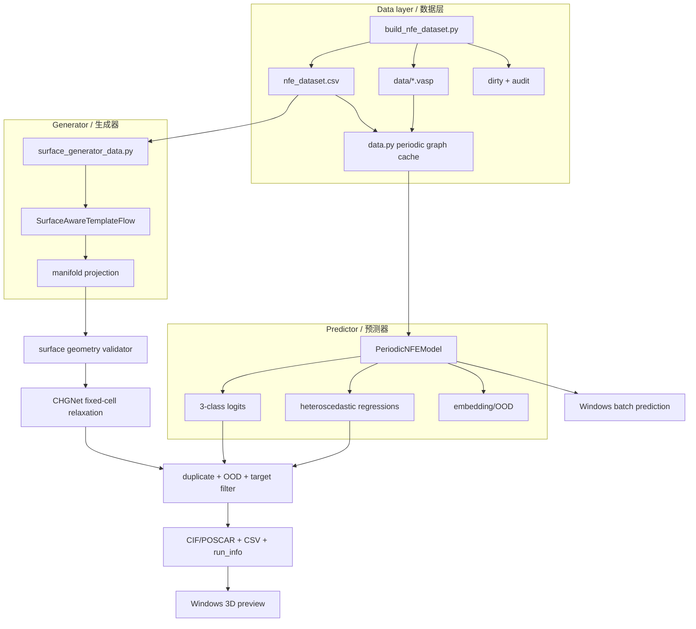
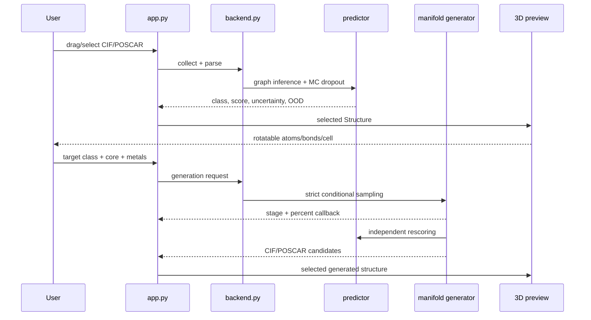
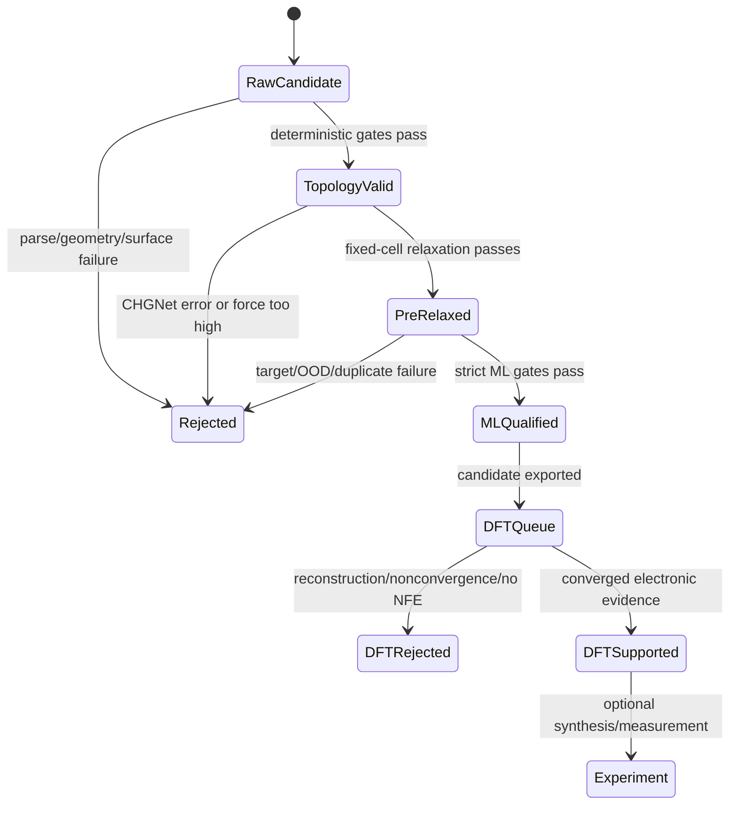

# 架构说明 / Architecture

作者 / Author: Ruck  
生成时间 / Generated: 2026-07-30

## 科学问题分解 / Scientific decomposition

系统把一个容易混淆的“AI 生成 NFE 材料”命题拆为四个可独立检验的问题：

1. **表型构建：** VASP 结果能否被转化为一致、可追溯的 NFE 证据？
2. **正向代理：** 给定结构，模型能否在独立家族 split 上预测 NFE 档位及相关物性？
3. **逆向提案：** 给定目标档位和骨架约束，模型能否提出不在数据表中的候选？
4. **物理接受：** 候选是否满足 MXene 表面拓扑、低残余力、目标复评和非重复条件？

四个问题由不同模块负责。生成器不负责证明自己的 NFE 性质，预测器不负责证明能量
稳定性，CHGNet 也不负责给出最终电子结构结论。

## 组件边界 / Component boundaries

## 预测张量 / Predictor tensors

一个 batch 不是补零密集张量，而是把所有原子与边拼接：

- `z`: `[N_atoms]`，原子序数；
- `node_features`: `[N_atoms, 14]`，元素物性；
- `edge_index`: `[2, N_edges]`；
- `edge_distance`: `[N_edges]`，Å；
- `edge_unit`: `[N_edges, 3]`；
- `batch`: `[N_atoms]`，每个原子所属结构；
- `global_features`: `[N_graphs, 11]`；
- 分类输出 `[N_graphs, 3]`；
- 回归均值/对数方差 `[N_graphs, N_targets]`。

消息传递保持旋转等变：标量不随旋转改变，向量通道随笛卡尔旋转同步变化。

## 生成状态 / Generator state

每个生成样本包含：

- 固定原子组成和模板角色；
- 分数坐标状态；
- 晶格参数状态；
- 时间 `t`；
- NFE 条件；
- surface generator 的层、表面、氢、锚点和模板坐标；
- classifier-free guidance 的有条件与无条件速度。

ODE 采样后依次执行流形投影、居中、近接触修复、表面拓扑检查、CHGNet、重复检查、
OOD 和目标分类匹配。任何失败都写入 `run_info.json`，不会静默丢弃原因。

## Windows 调用关系 / Windows call graph

GUI 后台任务不直接修改 Tk 控件，而是通过回调/事件交还主线程，以避免窗口假死。

## 模型职责关系 / Model responsibilities

- **NFE predictor**：中心化结构、low/medium/high 三分类、多任务回归。
- **surface generator**：条件连续流、表面模板、角色掩码、端点/锚点/OH/层损失。
- **manifold generation**：在 surface generator 权重上加入流形投影和训练集未见金属组合替换；不是重新训练的独立网络。
- **Windows application 1.0**：NFE predictor + Windows 转换后的 manifold generator + 三维预览。

因此 `manifold_generator/best_generator.pt` 与 surface generator 权重主体相同，
其关键差异还包含 manifold generator 推理代码和派生元数据，不能只复制权重而忽略代码。

## 证据状态机 / Evidence state machine

程序输出止于 `MLQualified/DFTQueue`，不会自动把候选标注为 `DFTSupported`。
