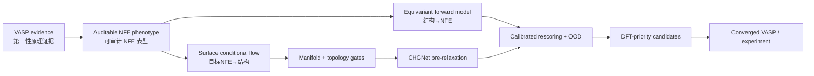

# 详细技术栈 / Detailed Technology Stack

作者 / Author: Ruck  
生成时间 / Generated: 2026-07-30

本文回答“每个部分具体用了什么技术、为什么使用、数据如何流动”。版本以最终环境快照为准。

## 0. 技术全景 / Technology at a glance

| 研究层级 | 核心技术 | 输入表示 | 主要输出 | 选择该技术的科学原因 | 主要风险 |
|---|---|---|---|---|---|
| 第一性原理数据 | VASP 文件解析、pymatgen、NumPy | 弛豫结构、能带、DOS、势/电荷网格 | 118 字段与 clean/dirty/audit | NFE 不能由结构标签单独定义，需要电子结构证据链 | 上游计算设置和伪标签规则会引入系统偏差 |
| 周期结构学习 | 周期邻居图、最小像、元素物性 | 原子、晶格、周期像边 | 稀疏图 batch | 保持平移/周期一致性并支持不同原子数 | 邻居截断可能遗漏长程表面效应 |
| NFE 正向预测 | PaiNN 风格旋转等变 GNN、多任务异方差回归 | CIF/POSCAR 周期图 | 三档概率、连续分数、辅助性质 | 方向信息影响层状材料几何，辅助任务提供物理正则 | low 类不平衡、OOD 外推 |
| 可信度 | 温度缩放、MC dropout、embedding OOD、conformal radius | logits、随机前向、训练嵌入 | 校准概率、不确定性、风险 | 区分“高分”与“可靠” | 经验覆盖依赖 split 代表性 |
| NFE 逆向生成 | Conditional flow matching、ODE、CFG | 模板状态 + NFE/组成条件 | 连续结构候选 | 处理一对多的目标到结构逆问题 | 原始输出不保证物理有效 |
| MXene 表面建模 | 2D 周期 KNN、角色/层/端基掩码、锚点损失 | core、surface、OH、上下表面 | 表面合理的速度场 | 普通三维生成表示不能可靠保持真空层与端基 | 强模板先验限制完全自由创新 |
| 生成后门控 | 流形投影、确定性几何规则、StructureMatcher | 神经网络原始候选 | 可解析、不重复、拓扑合格结构 | 把学习多样性与物理约束分工 | 规则范围受训练集覆盖限制 |
| 快速势能预筛选 | CHGNet、ASE 固定晶胞优化 | 几何合格候选 | 能量、力、预弛豫结构 | 在 VASP 前排除高残余力候选 | CHGNet 不是本任务专用 DFT 替代 |
| 高性能训练 | PyTorch、DDP/NCCL、AMP | group-aware train/val/test | 检查点、历史、指标 | 4×3090 并行训练与可恢复实验 | 多卡复现仍受硬件/随机性影响 |
| 科研软件交付 | Tkinter、Matplotlib 3D、PyInstaller、ZIP64、SHA256 | 文件、模型与元数据 | GUI、可运行包、可审计归档 | 让 HPC 模型可被非开发用户复核和使用 | onedir 体积较大，必须保留依赖目录 |

技术链应按以下逻辑理解：

项目的技术创新位于 NFE 任务定义、MXene 表面表示和闭环组合，不把 PaiNN、Flow
Matching 或 CHGNet 本身声明为原创。科学定位见
[`SCIENTIFIC_OVERVIEW.md`](SCIENTIFIC_OVERVIEW.md)。

## 1. 数据与材料信息学 / Data and materials informatics

### VASP 结果解析

入口是 `data_tools/build_nfe_dataset.py`。它只读取上游 `static_calc/`，不会修改原计算目录。

| 文件 | 提取内容 | 对模型的作用 |
|---|---|---|
| `CONTCAR`/`POSCAR` | 晶格、元素、分数坐标、层厚、真空层、最小原子距 | 图网络主输入与结构质量 |
| `OUTCAR` | 完成标志、电子收敛、能量、费米能级、磁矩、警告 | 质量门控与辅助目标 |
| `OSZICAR` | SCF 步数和收敛轨迹摘要 | 脏数据判断 |
| `EIGENVAL` | 自旋能带、占据、VBM/CBM、带隙、Γ 附近色散 | NFE 候选能带和有效质量 |
| `DOSCAR` | 费米能级 DOS、自旋极化 | 金属性与辅助回归 |
| `PROCAR`（若存在） | Γ 点候选带的 s/p/d 原子投影 | NFE 原子投影分量 |
| `LOCPOT` | 真空能级、上下表面功函数、真空电场/不对称 | 表面电子环境 |
| `ELFCAR` | 上下表面与深真空 ELF | NFE 表面/真空局域性描述 |
| `CHGCAR` | 表面与真空电荷分数 | 辅助表面电子描述 |

主要库：

- **pymatgen 2024.8.9**：CIF/POSCAR/VASP 结构读写、周期结构、元素属性和结构匹配。
- **NumPy 1.26.4**：网格剖面、最小像、拟合、分位数和向量化数值处理。
- **pandas 2.2.3（服务器）/ 2.3.3（Windows 构建）**：118 列表格、掩码、划分和导出。
- **SciPy 1.15.3**：pymatgen/CHGNet 的数值依赖及部分科学计算。

### NFE 伪标签

`NFE_Pseudo_Score` 组合以下组件：

1. 候选能带的低原子投影（更接近真空/层间电子）；
2. Γ–K 与 Γ–M 的抛物线拟合质量；
3. 候选能量与费米能级的相对位置；
4. 有效质量与自由电子质量的接近程度；
5. 面内有效质量各向同性。

这些分量分别保存在 `NFE_Score_*_Component` 字段，便于审计。`NFE_Pseudo_Label`
由分数阈值映射为 low/medium/high。`NFE_Label_Is_Ground_Truth` 明确记录其不是人工真值。

## 2. 周期图数据层 / Periodic graph data layer

文件：`src/nfe_model/data.py`

- 用 pymatgen 邻居表或 NumPy 后备路径构造周期边；
- 每条边保存源/目标原子、笛卡尔距离、方向和晶格像偏移；
- 节点输入包含原子序数嵌入及 14 维元素物性；
- 图级输入包含 11 维结构/晶格不变量；
- `Split_Group` 分组断言防止相似家族跨数据集泄漏；
- 稳健中位数/IQR 归一化降低异常值影响；
- `.pt` 图缓存加速多轮训练，并用表格 SHA256 防止错配；
- collate 将不同原子数结构拼接为一个稀疏批次。

单位约定：距离 Å、能量 eV、磁矩 μB、有效质量为 `m_e` 倍数、分数坐标无量纲。

## 3. NFE 预测器 / NFE predictor

文件：`src/nfe_model/model.py`、`train.py`、`predict.py`、`metrics.py`

### 网络

最终模型是自定义 **PaiNN 风格周期等变消息传递网络**：

- Gaussian radial basis 展开原子间距；
- 标量通道描述化学/径向信息；
- 向量通道沿周期边方向传递几何信息；
- 6 层等变交互、hidden dim 192、vector dim 64；
- segment sum/mean/max 聚合得到图嵌入；
- 三分类头预测 low/medium/high；
- 异方差回归头同时预测 NFE 分数、相对费米能、原子投影、有效质量、功函数、
  带隙、DOS、ELF 和表面电荷等；
- 额外的掩码原子与坐标去噪目标作为自监督正则。

### 训练技术

- **PyTorch 2.6.0+cu118**；
- **DistributedDataParallel + NCCL**：1–4 GPU；
- **Automatic Mixed Precision**：降低显存与计算时间；
- AdamW、warmup + cosine decay、gradient clipping；
- class weights + label smoothing 处理类别不平衡；
- early stopping 与原子检查点写入；
- 温度缩放降低概率校准误差；
- 最佳 epoch 131。

### 不确定性与 OOD

- MC dropout 默认 30 次，输出概率均值/方差；
- 从训练嵌入库计算距离，识别训练分布外结构；
- conformal score radius 提供经验覆盖边界；
- GUI 将 OOD 风险和分类置信度一起展示，避免只看最大概率。

## 4. 条件晶体流生成 / Conditional crystal flow generation

文件：`surface_generator.py`、`surface_generator_data.py`、
`train_surface_generator.py`、`time_embedding.py`

### 基础连续流

采用 **conditional flow matching**。训练时在噪声状态与真实结构之间采样时间 `t`，
网络学习坐标与晶格速度场；生成时数值积分 ODE 从噪声走向结构。条件包括：

- NFE low/medium/high 或连续条件嵌入；
- 原子组成/模板；
- 时间 Fourier embedding；
- 可使用 classifier-free guidance 调整条件强度。

周期坐标差使用最小像，坐标速度按晶格尺度归一化；相同元素原子执行置换对齐，
避免原子编号任意性造成虚假大 loss。

### surface generator 表面模板流

MXene 不是普通三维晶体。surface generator 显式加入：

- 二维周期 XY KNN，避免真空方向错误连边；
- core/surface/hydrogen 角色掩码；
- 上下端基及其三配位 hollow 锚点；
- 5/6/7 原子层序；
- OH 内部键；
- 金属–端基配对距离；
- 独立的内核、表面、氢噪声尺度；
- endpoint、pair、layer、anchor、OH 和 repulsion loss。

这使表面 MAE 显著低于纯坐标生成，但测试 endpoint RMSE 仍为 0.447 Å，因此最终版本
不把神经网络原始输出直接交给 VASP。

### manifold generator 流形投影

文件：`src/nfe_model/manifold_generation.py`

- 将生成位移限制在已弛豫模板附近；
- 对内核、表面和 H 使用不同 XY/Z 位移上限；
- 将 OH 键投影到训练中位数约 0.9772 Å；
- 晶格应变上限 5%；
- 支持替换为训练集中未出现的核心/内层金属组合；
- 保持端基由模型/模板决定，用户只指定核心与内层金属。

这是“学习新候选”与“尽量靠近合理 MXene 流形”之间的工程折衷，不等于严格生成
分布的数学证明。

## 5. 物理后处理 / Physics-aware post-processing

文件：`surface_geometry.py`、`strict_generation.py`

筛选顺序：

1. CIF 重新解析；
2. slab 分数坐标中心校正到 `z=0.5`；
3. 最小原子距和共价半径比；
4. 5/6/7 层、层序和层间不交叉；
5. 上下各一个完整端基；
6. 端基限制为 F/Cl/Br/I/S/Se/OH；
7. 三配位 hollow 检查；
8. OH 与金属–端基键长落入训练分位；
9. **CHGNet 0.3.8 + ASE** 固定晶胞预弛豫，目标最大力 `< 0.05 eV/Å`；
10. 与训练结构做 StructureMatcher 重复检查；
11. 预测器独立复评目标 NFE 档位、MC 稳定性和 OOD。

CHGNet 是快速预筛选器，不替代目标泛函/赝势/截断能下的 VASP 弛豫。

## 6. Windows 桌面技术 / Windows desktop stack

文件：`app/windows/nfe_mxene_studio/`

- **Tkinter/ttk**：窗口、选项卡、表格、进度与线程安全事件；
- **tkinterdnd2 0.4.3**：单/多文件拖放；
- **Matplotlib mplot3d**：鼠标旋转、滚轮缩放、重置、CPK 色、元素图例；
- **pymatgen**：CIF/POSCAR 解析和导出；
- 周期键采用最小像，并显示边界幽灵像和 12 条晶胞边；
- 后台线程执行推理/生成，主线程仅更新 GUI；
- 生成核心通过回调报告 0–100% 阶段进度，GUI 使用确定型 `ttk.Progressbar`
  展示采样、CHGNet 弛豫、NFE 复评和文件导出；两次过采样尝试映射到不重叠区间，
  保证进度不会倒退；
- Windows 邻居表和旧版 CHGNet 图构建有局部兼容补丁；
- App 内含 predictor、manifold generator、表面几何元数据和 CHGNet 权重。

## 7. 打包与发布 / Packaging and release

- **PyInstaller 6.16.0 onedir**：避免单文件首次解压和超大模型问题；
- 最终 onedir 约 4.70 GB、3,598 个实际文件；Windows ZIP 额外嵌入一份发布清单，
  因此归档成员数为 3,599；
- **ZIP64**：支持超过 4 GiB 的完整程序归档；
- **SHA256**：服务器四包、本地源码包和最终程序包完整性校验；
- 原始服务器归档分别为 source/dataset/models/environment，避免用途混杂；
- GitHub 建议把大文件放 Releases；若必须版本化则使用 Git LFS。

## 8. 最终运行环境 / Reproduced environment

服务器快照：

- CentOS 7, Linux 3.10；
- Python 3.10.16；
- PyTorch 2.6.0+cu118，CUDA build 11.8；
- 4 × NVIDIA GeForce RTX 3090, 24 GiB；
- Intel Xeon Platinum 8375C, 128 logical CPUs；
- numpy 1.26.4, pandas 2.2.3, pymatgen 2024.8.9；
- ASE 3.23.0, CHGNet 0.3.8。

`nvidia-smi` 显示的“CUDA Version”是驱动支持上限，不必与 PyTorch wheel 的
`torch.version.cuda` 字符串完全相同；真正检查应使用 `torch.cuda.is_available()`、
设备数量和一次 CUDA 张量运算。

Windows 最终构建基于 Python 3.9 与 PyTorch 2.0.1+cu118 的兼容环境；研究训练源码
以 Python 3.10 + PyTorch 2.6 为参考。两者职责不同，请不要混用环境锁定文件。

## 9. 技术与科学结论的边界 / Technology-to-evidence boundary

| 技术输出 | 正确表述 | 不正确的过度解释 |
|---|---|---|
| softmax high probability | 在当前伪标签分布下更像 high | 该材料有同等概率可合成 |
| NFE score MAE | 对伪分数规则的拟合误差 | 对真实 NFE 物理量的实验误差 |
| endpoint/core/surface MAE | 生成器对训练结构几何的重建能力 | 生成材料的 DFT 稳定率 |
| CHGNet `fmax < 0.05` | 在该预训练 ML 势下达到低残余力 | 已达到目标 VASP 精度或热力学稳定 |
| low OOD | 图嵌入接近训练分布 | 新化学体系必然可靠 |
| 非训练集重复 | StructureMatcher 未判定为训练结构 | 完全原创且可获得专利的新材料 |

建议论文报告同时包含数据划分、逐类指标、校准、OOD、严格筛选通过率、DFT 弛豫
存活率和最终电子结构证据。
