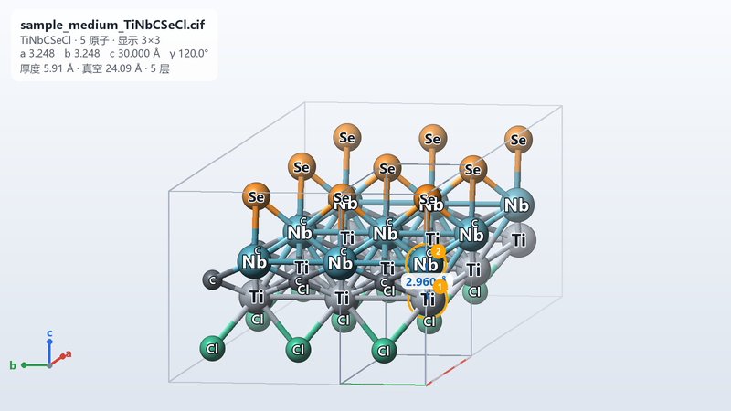

# Windows application 1.3.0 使用与构建 / Windows application 1.3.0 Usage and Build

作者 / Author: Ruck  
生成时间 / Generated: 2026-07-30；修订 / Revised: 2026-09-15

## 1.3.0 相对 1.2.0 的变化 / Changes since 1.2.0

- 内置生成器换为在 nfe-v1.1 标签上重训的表面模板生成器（4 张 RTX 3090，245 个 epoch，最佳 epoch
  209）；预测器、三维预览与 MXene 输入校验与 1.2.0 相同；
- 生成器测试集端点 RMSE 0.432 Å、内核 MAE 0.264 Å、表面 MAE 0.193 Å，
  1.0 生成器依次为 0.447、0.278、0.198 Å；
- 同一预测器、同样 12 组骨架与目标的严格生成对比：新生成器 12/12 组成功、导出 22 个候选，
  旧生成器 11/12 组、20 个；
- 程序目录与入口更名为 `NFE_MXene_Studio_1_3_0/NFE_MXene_Studio_1_3_0.exe`，窗口标题 "NFE MXene Studio 1.3.0"。

1.2.0 已被 1.3.0 取代。

## 1.2.0 相对 1.1.1 的变化 / Changes since 1.1.1

- 三维预览重写：由 Matplotlib 3D 换为 NumPy + Pillow 软件渲染（`structure_scene.py` 构建场景，
  `structure_render.py` 负责渲染、拾取与测量，`structure_preview.py` 为 Tk 组件），不新增依赖；
- 球体带漫反射、高光与描边，化学键为分色圆柱，按深度正确遮挡，并有深度雾化和 2 倍超采样抗锯齿；
- 新增视角预设、四种显示模式、三种着色、面内超胞、单击拾取与测量、元素高亮、三种背景、自动旋转
  和 PNG 导出，详见下文“三维预览”；
- 晶胞框默认只包住片层，避免 30 Å 真空把片层压成一条线，可切换为完整晶胞；
- 预览区较窄时（例如生成页右侧）工具栏自动折成两行并收起侧栏；
- 程序目录与入口更名为 `NFE_MXene_Studio_1_2_0/NFE_MXene_Studio_1_2_0.exe`，窗口标题
  "NFE MXene Studio 1.2.0"；模型权重、MXene 输入校验与 1.1.1 相同；
- 冻结自检新增一帧离屏渲染（`release_assets/windows/frozen_self_test_1_2_0.json`）。

1.1.1 已被 1.2.0 取代。

## 1.1.1 相对 1.1.0 的变化 / Changes since 1.1.0

- 导入结构时逐个检查是否为 MXene 片层（`nfe_model.mxene_validation`），判据见下文"输入校验"；
- 拖入或选择单个不合法文件时，弹出"输入文件不合法"并说明原因，文件不加入列表；多个文件或
  文件夹输入时只排除不合法的文件，其余照常加入，并弹窗列出被排除的文件与原因（最多 12 条，
  完整清单写入运行信息）；文件夹里的非结构文件（OUTCAR、日志等）仍然静默跳过；
- 合法但超出预测器训练范围的 MXene（n ≠ 1、未见金属或端基、单面无端基等）照常加入，只在
  运行信息中提示预测仅供参考；
- 预测前再检查一次，防止文件在加入列表后被改动，这类文件的状态显示为"不合法"；
- 训练集 15,206 个结构与 72 个隔离结构全部判为合法
  （`models/metadata/mxene_input_validation_audit.json`）；
- 程序目录与入口更名为 `NFE_MXene_Studio_1_1_1/NFE_MXene_Studio_1_1_1.exe`，窗口标题
  "NFE MXene Studio 1.1.1"，构建 spec `NFE_MXene_Studio_1_1_1.spec`；模型权重与 1.1.0 相同；
- 冻结自检新增输入校验项（`release_assets/windows/frozen_self_test_1_1_1.json`）。

1.1.0 已被 1.1.1 取代。

## 1.1.0 相对 1.0.1 的变化 / Changes since 1.0.1

- 预测器权重换为在 nfe-v1.1 表（PROCAR 自旋块修复后重抽）上按 `nfe_predictor_v1_1.yaml`
  训练的检查点（最佳 epoch 81；规范化输入、完整壳层、无全局特征、验证集拟合的 high-vs-rest
  阈值 0.50）；生成器权重不变（epoch 215，v1.0 标签）；
- `resources/predictor_final_metrics.json` 换为 1.1.0 指标；
- 程序目录与入口更名为 `NFE_MXene_Studio_1_1_0/NFE_MXene_Studio_1_1_0.exe`，窗口标题
  "NFE MXene Studio 1.1.0"，构建 spec `NFE_MXene_Studio_1_1_0.spec`；
- 冻结自检（RTX 4070 SUPER）通过：三个样例预测、3D 场景、Sc-C-Ta low 生成 1 个候选
  （CHGNet fmax 0.042 eV/Å，slab center 0.5，非训练集重复，OOD low），报告
  `release_assets/windows/frozen_self_test_1_1_0.json`。

1.0.1 与 1.0 的三个构建均已被 1.1.0 取代。

## 1.0.1 相对 1.0 的变化 / Changes since 1.0

- 预测前对每个输入做规范化（原胞、γ = 120°、c = 30 Å、slab 居中、平移规范），用户文件的
  真空厚度、晶格设定、超胞和平移不再改变预测；
- pymatgen Windows 轮子的 int64 兼容补丁移入核心包 `nfe_model.compat`，原胞约化与结构
  匹配在冻结程序内可用；
- 预测结果新增 `Predicted_High_vs_Rest` 与阈值列；
- 骨架的全部模板组成都已在训练集中时，生成显式允许训练集匹配（1.0 计算了该状态却未传入，
  会导致全部候选被去重拒绝）；
- 程序目录与入口更名为 `NFE_MXene_Studio_1_0_1/NFE_MXene_Studio_1_0_1.exe`，窗口标题
  “NFE MXene Studio 1.0.1”。模型权重与 1.0 相同（predictor epoch 131、generator epoch 215）。

1.0 的三个同日构建（14:39、22:25、23:00）均被 1.0.1 取代；它们的清单仍保留在
`release_assets/windows/` 供核对。

## 用户功能 / End-user features

### 批量 NFE 预测

- 拖入一个或多个 CIF/POSCAR；
- 文件选择器支持多选；
- 目录导入会收集可识别结构文件；
- 结果同时给出 low/medium/high 三档概率和连续 NFE 分数；
- 显示置信度、MC 不确定性、OOD 和辅助物性；
- 结果可导出 CSV。

### 输入校验 / Input validation

导入的每个结构依次检查以下条件，任一不满足即判为不合法：

1. 能被读取为有序晶体结构，没有部分占位；
2. 只含 MXene 元素：早期过渡金属 M（Sc、Y、Ti、Zr、Hf、V、Nb、Ta、Cr、Mo、W、Mn）、C 或 N，
   以及端基元素 O、H、F、Cl、Br、I、S、Se、Te，并且至少有一种 M 和一种 C/N；
3. 恰好一个方向存在不小于 6 Å 的真空层，以排除体相晶体、分子、团簇和纳米带；
4. M 与 C/N 的原子数之比为 (n+1):n，n = 1–4；
5. 沿片层法向的内核层序为 M-X-M…-M，C/N 全部夹在金属层之间；
6. 端基位于最外层金属之外并与表面金属成键，H 只作为 OH 出现；每个 C/N 至少有 3 个金属近邻，
   每个金属至少与一个 C/N 成键。

阈值以训练集 15,206 个 DFT 弛豫结构的几何极值为依据留出余量，例如偏心的 W/Mo/Cr 氮化物中
N 距外侧金属面只有 0.30 Å。阈值集中在 `src/nfe_model/mxene_validation.py` 顶部，可按课题组约定修改。
这项检查只判断结构类型，不评价稳定性或 NFE 性质。

### 条件生成

用户只选择：

- 目标 NFE：低/中/高；
- 核心：C/N；
- 两种内层金属；
- 候选数等运行选项。

端基不可手工强制，由模型与训练模板分布决定。输出 CIF 和 POSCAR。

生成页提供 0–100% 确定型进度条，依次展示模板选择、流生成采样、几何/表面拓扑
筛选、周期图构建、初始 NFE 预测、CHGNet 固定晶胞预弛豫、弛豫后 NFE 复评、
训练集/候选去重和 CIF/POSCAR 导出。若第一次严格筛选不足而自动增加过采样，
总进度仍保持单调递增。

### 三维预览

预测页下方和生成页右侧各有一个预览区，由上方下拉框选择要看的文件或候选。



工具栏：

- **视角**：等轴测、俯视（沿片层法向）、侧视 a、侧视 b；“复位”回到等轴测并适配窗口，“适配”只调整缩放；
- **模式**：球棍、空间填充、棍状、线框；**着色**：按元素、按层（沿法向自动分层）、按高度；
- **超胞**：面内重复 1–6 × 1–6，默认 3 × 3；**晶胞**、**标签**、**镜像**（跨边界成键的周期镜像，半透明）；
- **显示 ▾**：完整晶胞（含真空）、透视投影、深度雾化、自动旋转、信息框、坐标轴、浅色/深色/白底背景、
  原子与键的放大缩小；
- **导出图片**：按当前视角以 2 倍分辨率保存 PNG；**面板**：显示或收起右侧栏。

鼠标与键盘：

- 左键拖动旋转，Shift + 左键拖动绕视线旋转，右键或中键拖动平移，滚轮以光标为中心缩放；
- 单击原子选中，侧栏显示元素、坐标、距片层底面高度、所在层与配位；依次单击 2–4 个原子，画面与侧栏
  显示距离、键角和二面角；Ctrl + 单击追加选择，单击空白或 Esc 清除；
- 双击原子把它设为旋转中心，双击空白复位；悬停时右下角显示原子名称、高度与层号；
- 右键单击弹出常用菜单；快捷键 1–4 切换视角，R 复位，F 适配，L 标签，空格自动旋转，方向键旋转，
  +/− 缩放，Ctrl + = / Ctrl + − 调整原子大小。

侧栏的元素图例列出每种元素的颜色、个数和共价半径，单击某个元素会高亮它、淡化其余原子，再次单击取消。
画面左上角的信息框给出文件名、化学式、原子数、晶格常数、片层厚度、真空厚度与层数，左下角是 a/b/c
坐标轴（红/绿/蓝）。拖动时先用快速草图渲染，松开约 0.2 秒后自动补一帧精细渲染。

它用于快速检查，不是 VESTA 的完整替代品；对称性、轨道、体数据和出版级复杂渲染仍建议使用 VESTA。

## 安装最终程序 / Install the final program

从 [`DOWNLOADS.md`](DOWNLOADS.md) 下载 Windows ZIP 的 `part01` 和 `part02`，使用
`scripts/reassemble_release_parts.py` 合并并校验后再解压。原始 ZIP 超过 GitHub
单附件 2 GiB 限制，因此不能作为一个 Release 附件发布。

运行：

`NFE_MXene_Studio_1_3_0/NFE_MXene_Studio_1_3_0.exe`

注意：

- 解压 ZIP 后会得到完整的 `NFE_MXene_Studio_1_3_0/` 目录；
- 保留整个目录；
- `_internal/` 不能移动或删除；
- 首次加载 CUDA/PyTorch/CHGNet 可能较慢；
- 没有可用 GPU 时部分预测可退回 CPU，但生成会显著变慢；
- 杀毒软件可能对大型未签名 PyInstaller 程序提示，请先核对 SHA256。

最终 ZIP64、分卷和入口 EXE 的 SHA256 见 `release_assets/windows/SHA256SUMS_1.3.0.txt` 与同名 `.manifest.json`。

## 源码结构 / Source layout

```text
app/windows/
├─ nfe_mxene_studio/
│  ├─ app.py                 # GUI、任务线程、表格、预览联动
│  ├─ backend.py             # 模型加载、输入筛选、预测、生成与导出
│  ├─ structure_preview.py   # 三维预览 Tk 组件：工具栏、画布交互、侧栏
│  ├─ structure_render.py    # NumPy + Pillow 软件渲染、拾取与测量
│  ├─ structure_scene.py     # 场景：配色、键、周期镜像、超胞、分层、晶胞框
│  └─ smoke_test.py          # 无 GUI 冒烟测试
└─ packaging/
   ├─ build_windows.ps1          # -ReleaseName 默认 NFE_MXene_Studio_1_3_0
   ├─ NFE_MXene_Studio.spec      # 生产 spec（数据、隐藏导入、排除项）
   ├─ NFE_MXene_Studio_1_0.spec  # 1.0 产物名
   ├─ NFE_MXene_Studio_1_0_1.spec
   ├─ NFE_MXene_Studio_1_1_0.spec
   ├─ NFE_MXene_Studio_1_1_1.spec
   ├─ NFE_MXene_Studio_1_2_0.spec
   ├─ NFE_MXene_Studio_1_3_0.spec  # 1.3.0 产物名（当前）
   └─ requirements-windows.txt
```

构建树布局（PyInstaller 需要 `windows_app/` 与 `nfe_model/` 并列）：

```text
_build/
├─ nfe_model/            # src/nfe_model 的副本
└─ windows_app/          # app.py、backend.py、structure_preview/render/scene.py、smoke_test.py、__init__.py、
   ├─ *.spec              #   生产 spec 与版本 spec、requirements-windows.txt
   ├─ models/             # nfe_predictor.pt（1.1.0 检查点）、mxene_generator.pt（1.3.0 起为 v1.1 生成器）
   ├─ resources/          # surface_geometry_summary.json 与两份 metrics
   └─ samples/            # low/medium/high 样例 CIF 与 POSCAR
```

在 `_build/` 下执行 `python -m PyInstaller --noconfirm windows_app/NFE_MXene_Studio_1_3_0.spec`
（Python 3.9 + PyInstaller 6.16 + torch 2.0.1+cu118 环境），产物在 `dist/NFE_MXene_Studio_1_3_0/`，
约 4.4 GB、3,598 个文件。构建完成后运行冻结自检：

```powershell
dist\NFE_MXene_Studio_1_3_0\NFE_MXene_Studio_1_3_0.exe --self-test-output selftest.json
```

可重建源码包
[`NFE_MXene_Studio_1.3.0_Source_20260916.zip`](https://github.com/Ruckker/Ruck-NFE-MXene-Studio/releases/latest/download/NFE_MXene_Studio_1.3.0_Source_20260916.zip)
额外包含
最终 `src/nfe_model/`、模型、元数据、样例与全部最终测试，不含旧生成器和旧测试。

## 重新构建 / Rebuild

参考最终兼容环境为 Python 3.9、PyTorch 2.0.1+cu118。普通依赖可用清华源：

```powershell
python -m pip install -r app\windows\packaging\requirements-windows.txt `
  -i https://pypi.tuna.tsinghua.edu.cn/simple
```

CUDA PyTorch 与 PyG 扩展的 `+cu118` wheel 通常不在普通 PyPI 镜像，应使用已经验证的
本地 wheel；不要让 pip 自动换成 CPU torch。

源码包布局就绪后：

```powershell
powershell -ExecutionPolicy Bypass -File app\windows\packaging\build_windows.ps1 `
  -Python C:\path\to\python.exe
```

最终 spec 收集：

- app 与 `nfe_model`；
- predictor/generator `.pt`；
- predictor/generator metrics 和表面 profile；
- pymatgen 数据；
- CHGNet 权重；
- Tkinter/tkinterdnd2/Pillow（三维预览渲染）；
- PyTorch/CUDA DLL。

## 冒烟测试 / Smoke test

源码：

```powershell
python -m app.windows.nfe_mxene_studio.smoke_test
```

公开仓库采用 `app.windows.nfe_mxene_studio`，可重建源码 ZIP 为保持 PyInstaller
原始布局则采用 `windows_app`；代码中的兼容导入支持两种形式。

冻结程序支持自动 self-test（`--self-test-output`），1.0 至 1.3.0 各版本均已验证：

- low/medium/high 三个样例预测；
- 3D 场景原子、周期键、幽灵像和晶胞；
- 生成 ScTaCSeBr low 候选；
- CIF/POSCAR 再解析一致；
- slab center 0.5；
- CHGNet 最大力低于 0.05 eV/Å；
- 非训练集重复、低 OOD；
- 1.1.1 起：四个样例通过 MXene 输入校验，岩盐 TiC 体相与文本文件被排除；
- 1.2.0 起：离屏渲染一帧 800×450 的 3×3 球棍视图并保存 PNG。

这些是软件冒烟证据，不是该材料的最终 VASP 证据。
