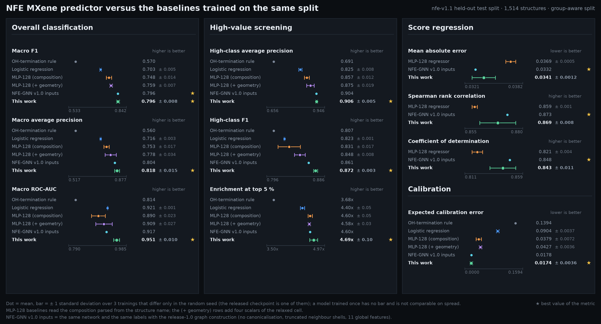
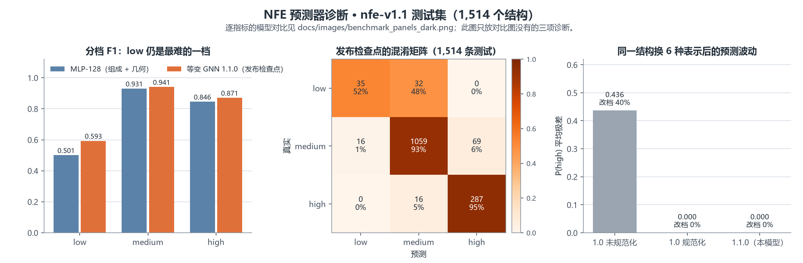
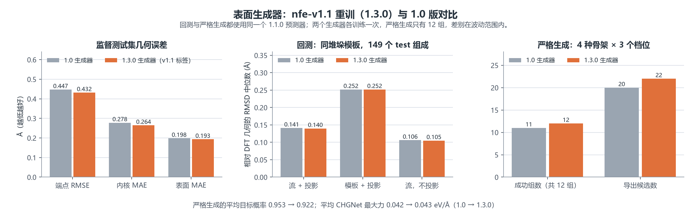

# 模型卡 / Model Card

作者 / Author: Ruck  
生成时间 / Generated: 2026-07-30

## 模型清单 / Model inventory

| 模型 | 归档路径 | 用途 |
|---|---|---|
| NFE predictor 1.1.0 | `nfe_predictor_v1_1/best.pt`（1.3.0 模型归档） | 1.1.0 发布预测器：nfe-v1.1 标签、规范化输入、完整壳层、无全局特征；三分类 + high-vs-rest、多物性、OOD |
| NFE predictor 1.0 架构对照 | `nfe_predictor_v1_0arch_on_v1_1/best.pt`（1.3.0 模型归档） | 1.0 架构与超参在 v1.1 表上的单 seed 对照，仅供报告 |
| NFE predictor 1.0 | `ruck_dp/nfe_predictor/best.pt` | 1.0 预测器（nfe-v1.0 标签）；三分类、多物性、OOD |
| surface generator v1.1 | `surface_generator_v1_1/best_generator.pt`（1.3.0 模型归档） | 1.3.0 起发布的表面模板条件流，nfe-v1.1 标签；Windows 版为同目录 `mxene_generator_v1_1.pt` |
| surface generator 1.0 | `ruck_dp/surface_generator/best_generator.pt` | 表面模板条件流（nfe-v1.0 标签，仅供复现） |
| manifold generator derived generator | `ruck_dp/manifold_generator/best_generator.pt` | 与 manifold generator 推理/流形投影配合 |

完整模型归档通过 GitHub Release 发布：

[下载 nfe_server_models_1.0_20260730.zip](https://github.com/Ruckker/Ruck-NFE-MXene-Studio/releases/latest/download/nfe_server_models_1.0_20260730.zip)

完整下载表见 [`../docs/DOWNLOADS.md`](../docs/DOWNLOADS.md)。

SHA256:

`CBD941DC070CB5BF68FDBB1EFD68821619F976E67C45E9850CB2CBF06F058B36`

该值对应完整服务器模型 ZIP，而不是单个 `.pt` 文件。

v1.1 模型归档（1.3.0，安装到 `models/server_v1_1/`；含 1.1.0 预测器、1.0 架构对照、v1.1 表面生成器与
其 Windows 版、流形派生信息、指标、训练历史、服务器配置与日志；取代只含预测器的 1.1.0 归档）：

[下载 nfe_server_models_1.3.0_20260916.zip](https://github.com/Ruckker/Ruck-NFE-MXene-Studio/releases/latest/download/nfe_server_models_1.3.0_20260916.zip)

SHA256：`23E511215D6B5D6ED5E304BF98E26338C601766EAB593D6A3D5487E711762A80`

## 预期用途 / Intended use

- 筛选 MXene NFE 候选；
- 对输入 CIF/POSCAR 预测 low/medium/high 与连续分数；
- 在训练化学空间附近提出由 VASP 验证的新结构；
- 教学和模型消融。

### 研究决策位置 / Position in the research workflow

该模型适合作为 **surrogate screener and hypothesis generator**：

\[
\text{large candidate space}
\rightarrow \text{ML ranking/generation}
\rightarrow \text{strict pre-screening}
\rightarrow \text{small DFT queue}.
\]

它不处于最终结论层。论文中应把模型输出描述为 predicted/pseudo-NFE candidate，
只有完成收敛电子结构分析后才能描述为 DFT-supported NFE material。

不适用于：

- 直接宣称实验可合成；
- 替代 VASP/DFT；
- 对完全不同材料家族做无验证外推；
- 计算热力学/动力学稳定性；
- 将伪标签当作实验标签。

## 训练数据 / Training data

15,206 个已弛豫后静态计算的 MXene，包含 C/N 核心、多种金属、F/Cl/Br/I/S/Se/OH
端基和不同堆垛。类别不均衡，medium 占主导。

## 预测性能 / Predictor performance

1.1.0 预测器（nfe-v1.1 表，test 1,514 条；本机复评与检查点内存储的指标一致）：

- accuracy 0.9122；balanced accuracy 0.7984；
- macro F1 0.8017；macro ROC-AUC 0.9610；
- high-vs-rest F1 0.8706（precision 0.808、recall 0.944、验证集拟合阈值 0.50）、
  ROC-AUC 0.9822、average precision 0.9003；
- low/medium/high F1 = 0.5932 / 0.9409 / 0.8710；
- calibrated ECE 0.0184（温度 0.80）；NFE score MAE 0.0355；conformal score radius 0.076。

同一 v1.1 表上的 1.0 架构对照（单 seed）：accuracy 0.9155、macro F1 0.7963、high-vs-rest F1
0.8614、macro ROC-AUC 0.9170；两者差别在单 seed 波动量级。

1.0 预测器（nfe-v1.0 表，1.0 发布值）：accuracy 0.87797、balanced accuracy 0.74838、macro F1
0.73404、macro ROC-AUC 0.92006、low/medium/high F1 = 0.5000/0.92314/0.77899、calibrated ECE
0.01373、NFE score MAE 0.03487。

v1.1 表的 test 只有 67 个 low 样本，召回 0.52，因此 low/medium 边界仍是主要短板。
不能用总体 accuracy 掩盖这一点。

1.1.0 架构在 nfe-v1.1 上重训了 3 个只改随机 seed 的模型（2027、2028、2029；发布检查点是
seed 2027，另两个用 `training/configs/nfe_predictor_v1_1.yaml` 只改 `seed` 复现）。三者在
测试集上的均值 ± 标准差：macro F1 0.7961 ± 0.0084、macro ROC-AUC 0.9512 ± 0.0098、macro AP
0.8183 ± 0.0152、high 对非 high F1 0.8723 ± 0.0032、high 类 AP 0.9057 ± 0.0054、前 5% 富集
4.69 ± 0.10 倍、ECE 0.0174 ± 0.0036、分数 MAE 0.0341 ± 0.0012、Spearman ρ 0.8691 ± 0.0076、
R² 0.8427 ± 0.0107（[`predictor_v1_1_evaluation.json`](metadata/predictor_v1_1_evaluation.json)）。

## 生成性能 / Generator performance

1.3.0 发布的表面生成器（nfe-v1.1 标签，4 张 RTX 3090，245 个 epoch，最佳 epoch 209）测试集：

- endpoint RMSE 0.43174 Å；core MAE 0.26443 Å；surface MAE 0.19321 Å；
- lattice loss 0.11517；layer loss 0；OH loss 0.001370。

1.0 生成器（nfe-v1.0 标签）依次为 endpoint RMSE 0.44717 Å、core MAE 0.27788 Å、surface MAE
0.19813 Å、lattice loss 0.11376、OH loss 0.001325。

同一预测器下的回测（`generator_backtest_gen_v1_1.json`）：流 + 投影 RMSD 中位 0.140 Å、档位一致率
0.886，与 1.0 生成器一致。严格生成对比（`generator_strict_generation_benchmark.json`，4 种骨架 × 3 档）：
新生成器 12/12 组成功、导出 22 个候选、平均目标概率 0.922；
1.0 生成器 11/12 组、20 个、0.953。样本量小，差别在波动范围内。

这些是训练目标重建指标，不等价于 DFT 稳定率。最终 manifold generator 依赖严格生成后处理。

回测（2026-09-15，200 个 test 组成，同堆垛训练模板，无 CHGNet，`generator_backtest.json`）：
流 + 投影相对 DFT 几何 RMSD 中位 0.15 Å，模板 + 投影 0.26 Å，晶格误差 1.3% 对 2.6%，
档位一致率 0.79 对 0.77。模板堆垛与目标不同时三种模式都约 1.1 Å。

## 创新定位 / Novelty statement

模型组件所借鉴的等变消息传递、条件流匹配和 CHGNet 均有独立来源。本项目的贡献是：

- 为 MXene NFE 建立包含物理分量和证据来源的专用学习目标；
- 在同一语义下联合正向 NFE 预测与目标条件结构生成；
- 将端基、上下表面、hollow 配位、OH 和层序纳入生成表示；
- 使用独立预测、OOD、重复检测与 ML 势构成生成接受协议。

因此，推荐将创新描述为 **domain-specific formulation and integrated
physics-gated workflow**，而非新的通用 GNN、通用流模型或通用原子势。

## 局限与风险 / Limitations and risks

- 发布模型均训练自 `nfe-v1.1` 表（PROCAR 自旋块已区分）：预测器自 1.1.0 起，表面生成器自 1.3.0 起；
  1.0 预测器与 1.0 生成器训练自 `nfe-v1.0` 表，该表磁性结构（31%）的投影可能与能带错配
  （见 `docs/DATASET.md` "已知问题"），仅供复现；
- 发布的预测器与生成器都只训练了一个 seed；
- 伪标签偏差会被模型继承；
- medium 类占比 81.4%，类别边界受不平衡影响；
- 对训练集中未覆盖的元素、层数、端基或大晶胞 OOD；
- CHGNet 的训练域与目标 MXene/端基不完全一致；
- manifold generator 的未见组合仍复用已见局部模板，不代表真正自由生成；
- PyTorch checkpoint 只应从可信来源加载；
- 模型生成结果可能在 VASP 弛豫中重构或坍塌。

## 2026-09-15 修订 / Revision notes

- 推理入口默认先规范化输入（`nfe_model.canonical`），1.0 检查点对真空厚度、晶格设定、
  超胞和平移的敏感性由此消除大半；规范化后 test 指标 macro F1 0.738、ECE 0.008；
- 新增 high-vs-rest 二分类输出与阈值；1.0 检查点没有拟合阈值，回退到 0.5；
- 1.0 发布的 test 指标包含 DDP 补齐的 2 个重复样本，去重后 accuracy 0.879、macro F1 0.735；
- 组成基线与 5 seed 消融见 `models/metadata/baseline_metrics.json` 与
  `ablation_seed_summary.json`；单 seed 的 0.734 处于 full 变体 0.722 ± 0.015 的上沿；
- 生成器无流基线回测见 `generator_backtest.json`；穷举筛选结果见 `enumeration_summary.json`。

## 1.1.0 修订 / Revision notes for 1.1.0

- 发布预测器换为 `nfe_predictor_v1_1.yaml` 在 nfe-v1.1 表上重训的检查点（集群 GPU 节点单卡
  RTX 3090，117 epoch 早停，最佳 epoch 81，约 10 分钟）；同表的 1.0 架构对照 macro F1 0.796
  对 0.802、high-vs-rest F1 0.861 对 0.871；
- v1.1 标签的组成基线 `baseline_metrics_v1_1.json`：MLP + 几何标量 macro F1 0.759 ± 0.007、
  high F1 0.846，GNN 领先约 0.04 macro F1；
- 确定性表示探针 `representation_probe_v1_1.json`：90 个 test 结构 × 6 种表示（真空 20/40 Å、
  γ = 60°、2×2×1 超胞、平移），1.1.0 检查点 P(high) 极差 0（关闭规范化亦为 0），1.0 检查点
  关闭规范化时平均极差 0.44、40% 改档；运行时的 MC dropout 样本差异属于不确定性，不是输入敏感性；
- v1.1 穷举筛选 `enumeration_summary_v1_1.json`：32,154 个未计算配置中 6,168 个预测 high 且
  OOD 低（1.0 检查点 5,333 个），全部含 OH 端基；
- 生成器权重不变，其回测以 1.1.0 预测器重新评估（`generator_backtest_v1_1.json`）。

## 1.3.0 修订 / Revision notes for 1.3.0

- 表面生成器在 nfe-v1.1 标签上重训（`training/configs/surface_generator_v1_1.yaml`，服务器配置
  `configs/server_surface_generator_v1_1.yaml`），其余超参数与 1.0 相同；测试集端点 RMSE 0.432 Å；
- Windows 版检查点只增加 `windows_app` 元数据，并把表面几何摘要改为相对路径 `resources/surface_geometry_summary.json`，
  权重与服务器检查点逐项相同；流形生成器继续复用这套权重；
- 回测与严格生成对比均未见退化：严格生成 12/12 对 11/12 组成功；
- 模型归档 `nfe_server_models_1.3.0_20260916.zip` 取代 `nfe_server_models_1.1.0_20260915.zip`。

## 正确解释 / Correct interpretation

“high 概率 0.9”表示模型在其训练分布和伪标签体系下更像 high，不表示 90% 的实验成功率。
应同时查看 MC 不确定性、OOD、几何、CHGNet、重复情况及最终 DFT。

## 建议报告规范 / Recommended reporting

使用模型发表结果时，至少报告：

1. 检查点哈希、数据 schema 和 group-aware split；
2. 三档全部概率、校准方式、MC 次数和 OOD 风险；
3. 生成数量、过采样数及每类拒绝原因；
4. CHGNet 优化设置、最终最大力及其仅作为预筛选的声明；
5. StructureMatcher 参数和训练集重复结果；
6. VASP 赝势、泛函、ENCUT、k 点、真空、偶极修正和收敛标准；
7. 最终 band-decomposed charge density、有效质量和 ELF/电荷证据。
